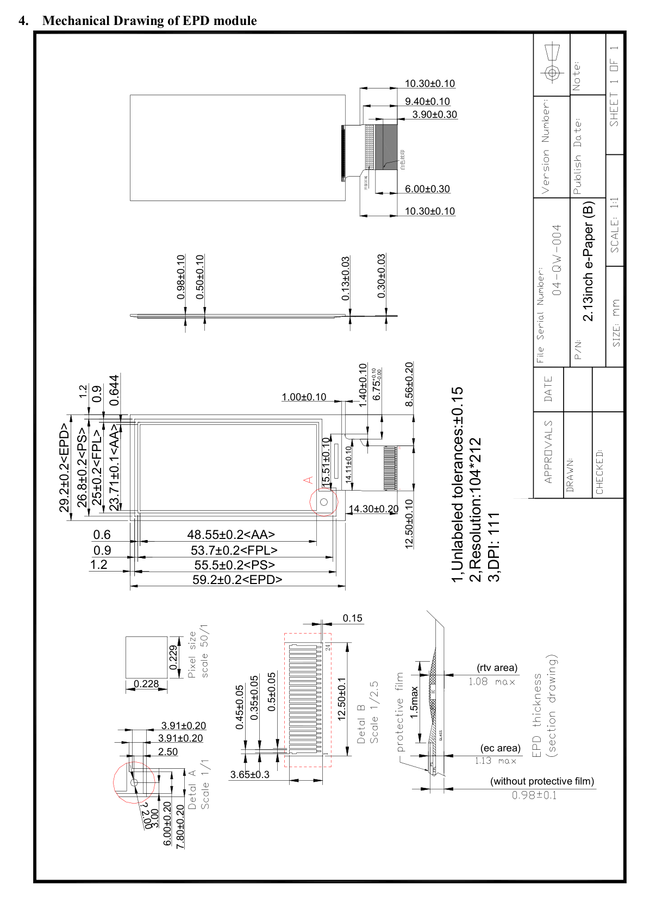
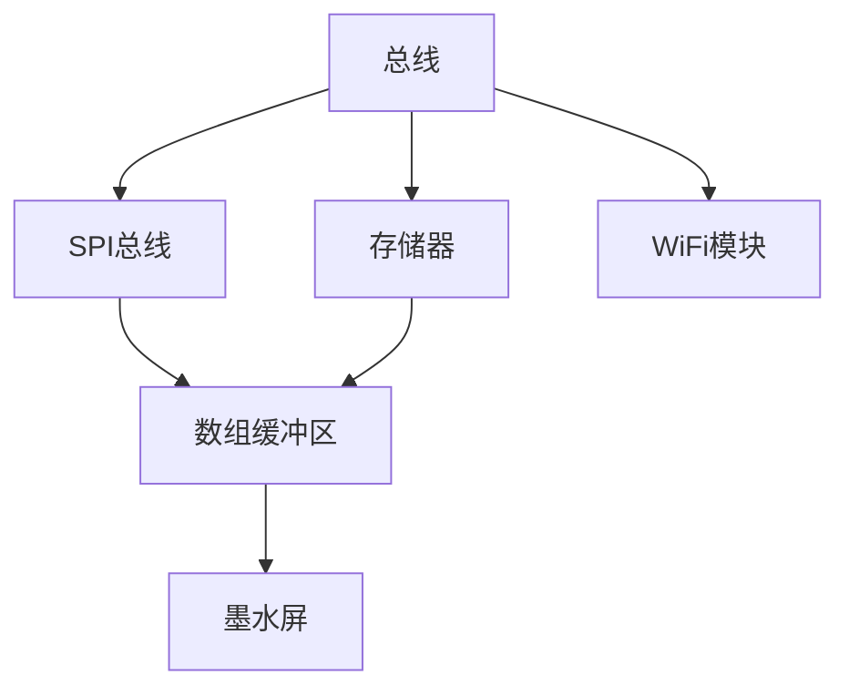
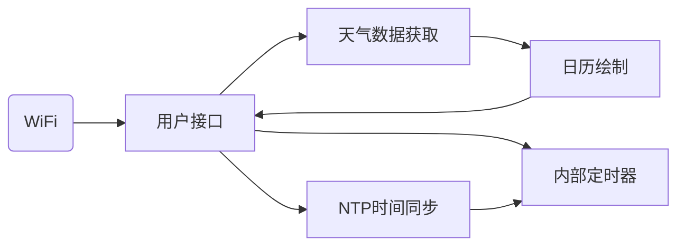
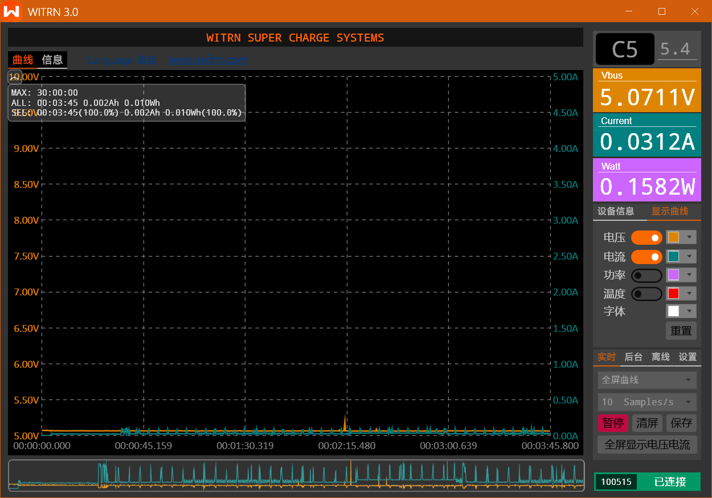
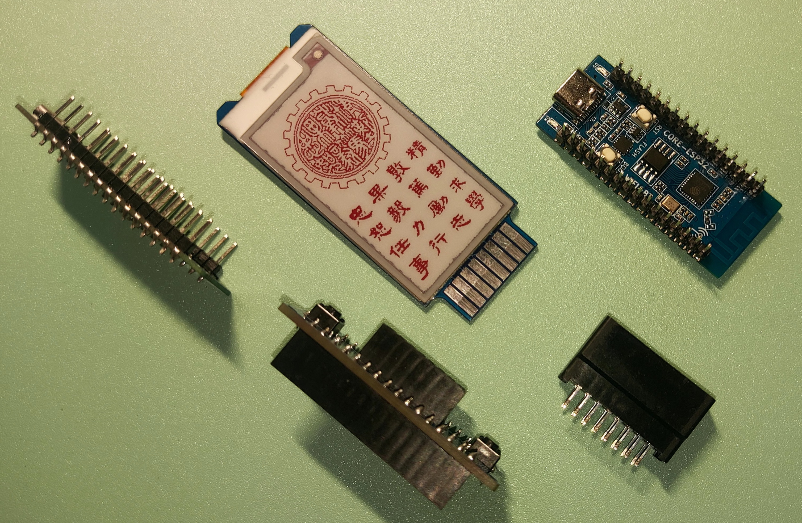
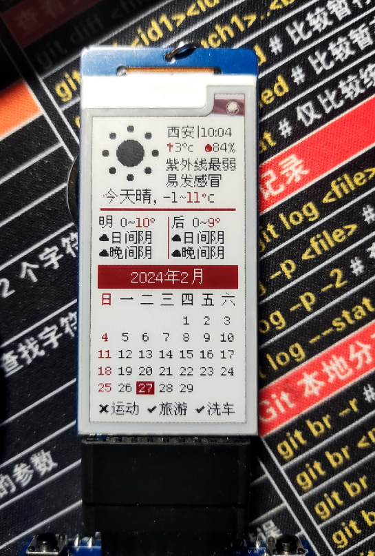
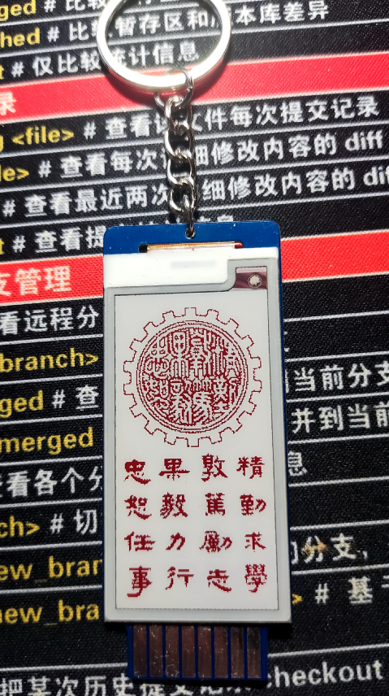
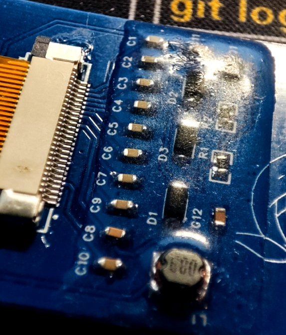

# 不知道是什么的介绍

---

[TOC]


## 概要

​	本文介绍了一种基于2.13寸串口墨水屏开发的桌面日历摆件的设计过程，并从以下五个方面进行说明：

- 需求
- 规格说明
- 体系结构
- 软硬件组件
- 系统集成


## 需求分析

- 功能性需求：
  - 能显示所在城市的天气以及日历，高亮显示当前日期；
  - 能作为电子相册使用，显示自定义图片；
  - 可以连接到WiFi，并定时刷新实时天气；
  - 在长时间静置后使墨水屏自动进入休眠模式，以降低功耗；
  - 配置两个按钮，用于模式切换等功能；
  - 有较为详细的引导，便于初次接触的人使用。
  
  
- 非功能性需求：
  - 在软件满足要求的同时，尽可能减小成本；
  - 底座尺寸尽可能小，以便于放置桌面；
  - 采用屏幕/底座分体式设计，便于制成钥匙扣携带；
  - 工作电流控制在50mA内，休眠电流控制在30mA以内，最大瞬时电流不超过100mA；
  - 保护屏幕驱动板背后的元器件，以防潜在的磕碰带来的损坏。


| 名称           | 桌面天气日历                                                 |
| -------------- | ------------------------------------------------------------ |
| 目的           | 为用户提供三天内天气预报及实时天气、<br />作为电子相册使用   |
| 输入           | 2个控制按钮                                                  |
| 输出           | 2个红色LED灯、分辨率为122x250的2.13寸三色墨水屏屏幕（无背光） |
| 功能           | 无线联网更新天气及时间；<br />简易的一键配网功能；<br />显示预置的图片 |
| 性能           | 15s内更新一次屏幕（全刷）                                    |
| 生产成本       | 34元                                                         |
| 功耗           | <160mW                                                       |
| 物理尺寸和重量 | 屏幕尺寸：30x60x1mm（不含排线）<br />底座尺寸：18x40x15mm    |


## 规格说明

### 天气接口

​	天气的获取源为<u>心知天气</u>[^1]

#### 天气实况

​	请求地址：`https://api.seniverse.com/v3/weather/now.json?key=your_api_key&location=beijing&language=zh-Hans&unit=c`

​	返回示例：

```json
{
  "results": [
    {
      "location": {
        "id": "C23NB62W20TF",
        "name": "西雅图",
        "country": "US",
        "path": "西雅图,华盛顿州,美国",
        "timezone": "America/Los_Angeles",
        "timezone_offset": "-07:00"
      },
      "now": {
        "text": "多云", //天气现象文字
        "code": "4", //天气现象代码
        "temperature": "14", //温度，单位为c摄氏度或f华氏度
        "feels_like": "14", //体感温度，单位为c摄氏度或f华氏度
        "pressure": "1018", //气压，单位为mb百帕或in英寸
        "humidity": "76", //相对湿度，0~100，单位为百分比
        "visibility": "16.09", //能见度，单位为km公里或mi英里
        "wind_direction": "西北", //风向文字
        "wind_direction_degree": "340", //风向角度，范围0~360，0为正北，90为正东，180为正南，270为正西
        "wind_speed": "8.05", //风速，单位为km/h公里每小时或mph英里每小时
        "wind_scale": "2", //风力等级，请参考：http://baike.baidu.com/view/465076.htm
        "clouds": "90", //云量，单位%，范围0~100，天空被云覆盖的百分比 #目前不支持中国城市#
        "dew_point": "-12" //露点温度，请参考：http://baike.baidu.com/view/118348.htm #目前不支持中国城市#
      },
      "last_update": "2015-09-25T22:45:00-07:00" //数据更新时间（该城市的本地时间）
    }
  ]
}
```


### NTP数据包

​	使用UDP进行接收，端口123，服务器为`ntp6.aliyun.com`。考虑到精度无需太高，截取64位时间戳的前48位。

```
0							   31  32							63
+--------------------------------++--------------------------------+
|		 时代起点至今的秒数		   ||		  秒数包含的小数部分        |
+--------------------------------++--------------------------------+
```


### 图片格式

​	图片分辨率为250x122，使用ImageToEPD软件进行取模。取模后产生两个C数组。

```C++
// XJTU 250x122
// 黑白部分取模
const unsigned char gImage_BWxjtu[4000] = {
    0XFF,0XFF,0XFF,0XFF,0XFF,0XFF,0XFF,0XFF,0XFF,0XFF,0XFF,0XFF,0XFF,0XFF,0XFF,0XFF,
    ...
    0XFF,0XFF,0XFF,0XFF,0XFF,0XFF,0XFF,0XFF,0XFF,0XFF,0XFF,0XFF,0XFF,0XFF,0XFF,0XFF,
}
// 红白部分取模
const unsigned char gImage_RWWxjtu[4000] = {
    0XFF,0XFF,0XFF,0XFF,0XFF,0XFF,0XFF,0XFF,0XFF,0XFF,0XFF,0XFF,0XFF,0XFF,0XFF,0XFF,
    ...
    0XFF,0XFF,0XFF,0XFF,0XFF,0XFF,0XFF,0XFF,0XFF,0XFF,0XFF,0XFF,0XFF,0XFF,0XFF,0XFF,
}
```


### 用户接口

​	用户通过墨水屏获取信息，并可使用底座上的两个按钮`KEEP`和`MODE`进行相应的功能配置。

#### KEEP按钮

​	长按：切换边框颜色（白/红/黑）

​	日历界面短按：手动刷新天气

​	相册界面短按：下一页

​	配网模式短按：清除所有配置并自动重启

#### MODE按钮

​	长按：进入配网模式

​	短按：切换模式


### 墨水屏

墨水屏使用四线SPI进行通信。

| 引脚名称 | 对应端口(GPIO) |
| -------- | -------------- |
| CS       | 7              |
| DS       | 4              |
| RST      | 5              |
| BUSY     | 6              |
| MOSI     | 3              |
| MISO     | 10             |

```c
// pins_arduino.h
static const uint8_t TX   = 21;
static const uint8_t RX   = 20;

static const uint8_t SDA  = 4;   
static const uint8_t SCL  = 5;  

static const uint8_t SS   = 7;
static const uint8_t MOSI = 3;  
static const uint8_t MISO = 10;  
static const uint8_t SCK  = 2;   
```


#### 操作指令（节选）

| 实现功能     | 16进制数据（控制指令用粗体标出） |
| ------------ | -------------------------------- |
| 开启电源     | **0x04**                         |
| 关闭电源     | **0x02**                         |
| 休眠         | **0x07** - 0xA5                  |
| 写入黑白数据 | **0x10** - data[]                |
| 写入白红数据 | **0x13** - data[]                |
| 刷新         | **0x12**                         |
| 边框颜色设置 | **0x50** - color                 |


#### 机械尺寸




##  体系结构设计

### 硬件组件

#### CPU

​	考虑到设备需要满足易联网、成本低廉、性能适中的要求，选择乐鑫的ESP32系列，该系列常用于低功耗的物联网设备。

​	在对比系列中的ESP32-C3、ESP8266、ESP32后，选择`ESP32-C3`，因其成本相对较低，且额外包含蓝牙5.0BLE功能，利于未来开发；此外，ESP32-C3的GPIO数相较于ESP8266更少，最大程度减小浪费。为便于拆装，选择现成的开发版。

​	考虑到生态、品控等问题，选择合宙的ESP32-C3经典款开发版，因其自带串口芯片，且采用TypeC口连接，利于后续调试。

​	ESP32-C3包含一颗ESP-RISC-V CPU，这是一颗基于RISC-V的32位CPU，有着高达160MHZ的主频，支持2路串口，15路GPIO，以及两组定时器。


#### 外设

​	屏幕选择汉朔的2.13寸红白黑三色墨水屏，排线为26Pin，丝印为`HS_E2.13SE_V1.0`。


### 软件组件

​	合宙ESP32-C3支持多种开发方式，如LuatOS、Arduino、ESP-IDF、MicroPython等。

​	考虑到生态问题以及代码运行效率，因Arduino的库较全，选择Arduino+CPP的方式进行开发。

​	为便于模块化调试及复用，将工程拆分为多个部分。

```shell
╭──  PowerShell  main ≡  ~4   False             0ms [10:19] 
╰─ F:\Tester
❯ tree src /f
F:\TESTER\SRC
│  Calendar.h				// 日历绘制相关
│  Config.h					// 配置文件
│  Config.h.example			// 示例配置文件
│  GB2312.h					// 字体相关
│  Myimg.h					// 图片相关
│  myString.h				// 天气代码相关
│  NTP.h					// NTP同步相关
│  PreFunc.h				// 预加载函数
│  SmartConfig.h			// 配网相关
│  Tester.cpp				// 主程序
│  TestFunc.h				// 测试函数
│  
└─pic
        xjtu.h
```


### 硬件体系结构




### 软件体系结构



## 软硬件组件设计

### 屏幕驱动板

​	为固定屏幕，并做成易拆卸结构，需重新绘制电路板。采用TNK野口通过金手指和底座连接，易于插拔。


### 屏幕驱动

​	在例程文件的基础上进行修改，以适配`u8g2Fonts`库和`GxEPD2`库。


### 主体程序

​	主体程序参照`https://oshwhub.com/small_da/ESP32C3mo-shui-ping-bai-jian`进行修改、精简。


## 系统集成

采用UART0口作为下载和调试串口。

```
16:41:08.580 > Reading EEPROM...
16:41:08.582 > WiFi: ********
16:41:08.582 > 密码: ********
16:41:08.584 > 密钥: ********
16:41:08.633 > 正在等待连接
16:41:09.268 > ..成功连接！
16:41:10.172 > WiFi Init End!
16:41:10.172 > wifiUnconfigure: 0
16:41:10.333 > Receive NTP Response
16:41:10.697 > 正在获取心知天气信息，请稍后...    
16:42:11.739 > ........................Long Keep
16:42:14.048 > Long Keep added
16:43:02.835 > Busy Timeout!
16:52:32.717 > Hibernating
16:53:02.729 > Busy Timeout!
```

​	在调试过程中，发现墨水屏的Busy并未正常释放，一直处于占用状态，但并不影响后续刷新。

​	经过测试，写入单片机的7张图片均能正常显示，边框颜色切换功能正常，休眠正常，但唤醒时用时比预计的更长[^2]。此外，不同模式下长按按钮的延时时间不同[^3]。


## 图片展示

<center class="half">
    
</center>
<br>

<center class="half">
    
</center>

​    


- 图一：四分钟连续功耗监测
- 图二：分体式设计


<style>
    .image-container img {
        margin: 0 2px; /* 调整左右空白的大小 */
    }
</style>
<center class="half image-container">
        
     
     
</center>


- 图三：日历页面
- 图四：相册页面
- 图五：背部元器件使用硅橡胶密封， 避免损坏


## 参考资料

1. [心知天气 API 使用手册（V3版） (yuque.com)](https://seniverse.yuque.com/hyper_data/api_v3)
2. [ESP32C3-CORE开发板 - LuatOS 文档](https://wiki.luatos.com/chips/esp32c3/board.html)
3. [Espressif esp-idf-zh_CN-v5.0.4-esp32c3.pdf](https://docs.espressif.com/projects/esp-idf/zh_CN/v5.0.4/esp32c3/esp-idf-zh_CN-v5.0.4-esp32c3.pdf)
4. [Zxis233/My213EPD: 使用ESP32C3开发的2.13寸三色墨水屏摆件/钥匙扣 (github.com)](https://github.com/Zxis233/My213EPD)
5. [ESP32C3墨水屏摆件 - 嘉立创EDA开源硬件平台 (oshwhub.com)](https://oshwhub.com/small_da/ESP32C3mo-shui-ping-bai-jian)


---

[^1]: [https://www.seniverse.com](https://www.seniverse.com/)
[^2]: 初步猜测是因为Busy未正常释放，导致超时达到上限。
[^3]: 使用delay+for循环的方式进行延时，可能和代码块长度有关。后续应改成内部硬件定时器方式计时。